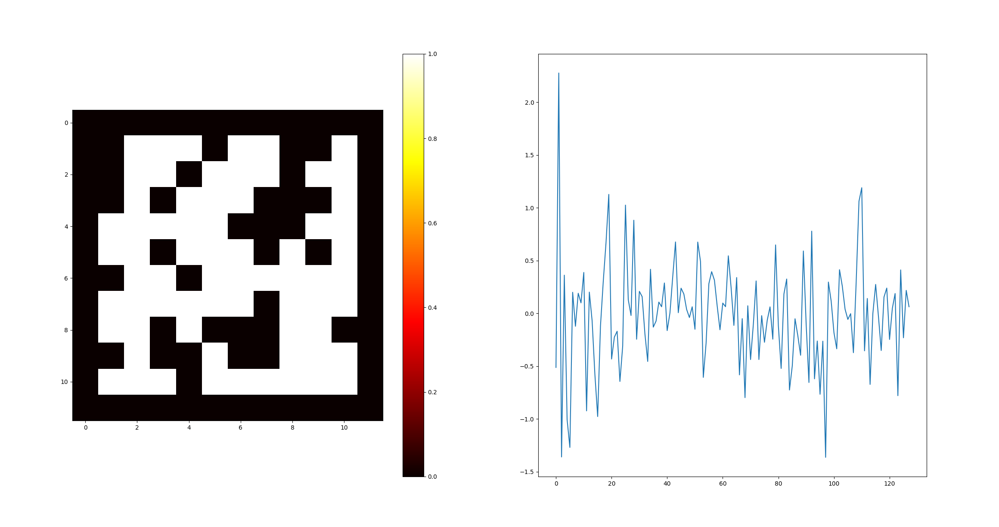

# Feature reconstruction dataset



----


## 数据集结构


* landscapes_np : 
  * 16226 张随机地图
  * 每张地图为 12x12 像素的二值图像，拉平为一个144长度的向量
  * 每张地图带有一个黑色外边框
* centroids_feature_space_transformed :
  * metaRL RNN 在这些地图中（路径优化任务）运行到稳定阶段后，通过 Policy Manifold 变换到特征空间后的神经状态
  * 包含 16226 个神经状态，分别对应了 16226 张随机地图
  * 每个神经状态是一个 128 维浮点向量


## 查看数据集


运行 expm/adaptive_trajectory_optimization/data_loader.py 即可查看数据：

```bash
python expm/adaptive_trajectory_optimization/data_loader.py
```


**其中，左侧为地图的全貌，右侧为特征空间的神经状态**


## 任务说明：验证特征空间的外生变量 U_Y 是否包含了【认知地图】的信息


1. 通过同时对策略表征（CCA[0:10]）以及外生变量（CCA[10:128]）两个表征同时进行 linear probe 训练，训练两个 decoder 通过这两部分表征对地图结构进行 recover，生成结果分别为 Map1 和 Map2
2. 比较 Map1 、Map2 中的哪一个更接近 Ground Truth
   1. 如果 Map1 更接近，可能【机制解释】这部分内容需要重新考虑新的研究方法
   2. 如果 Map2 更接近，对于运行机制的猜想得到了支持：
      1. U_Y 确实包含地图结构信息
      2. （结合之前的结果）地图结构信息通过维度调制作用，对策略起到了调控作用


